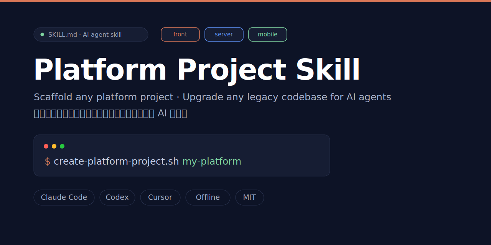
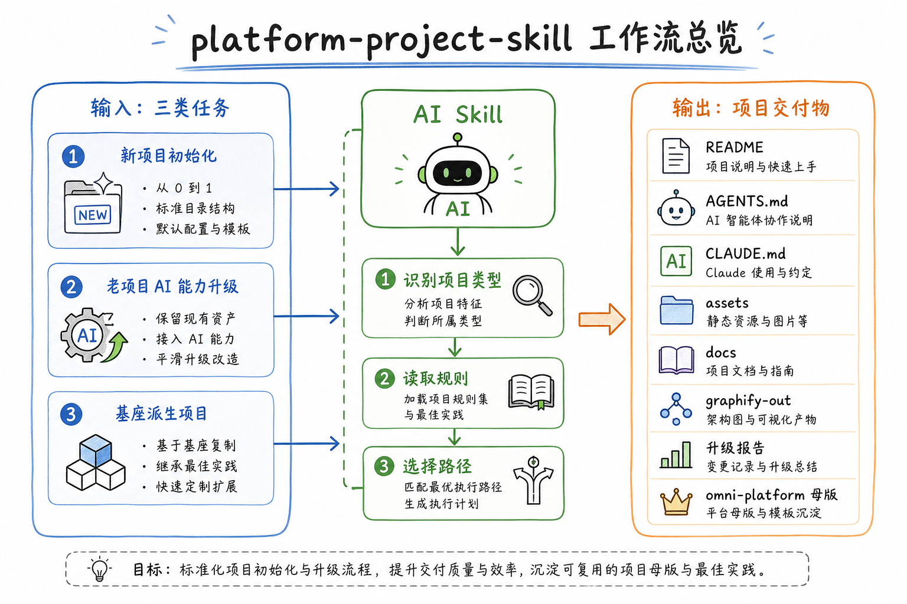
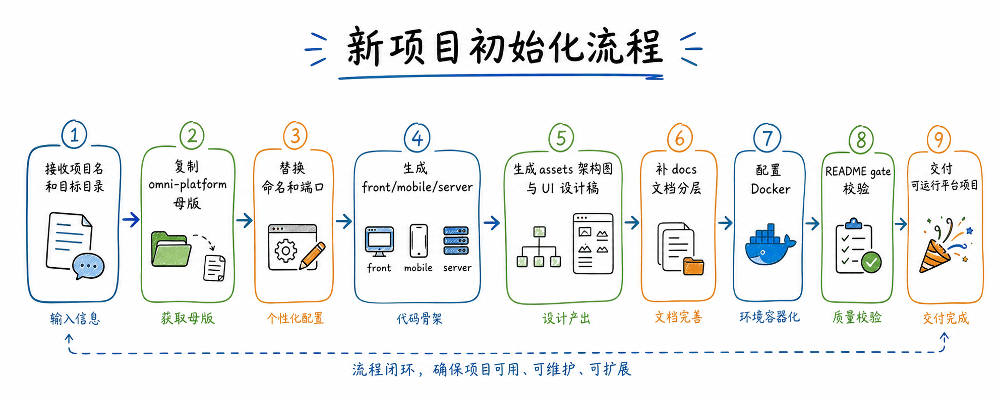
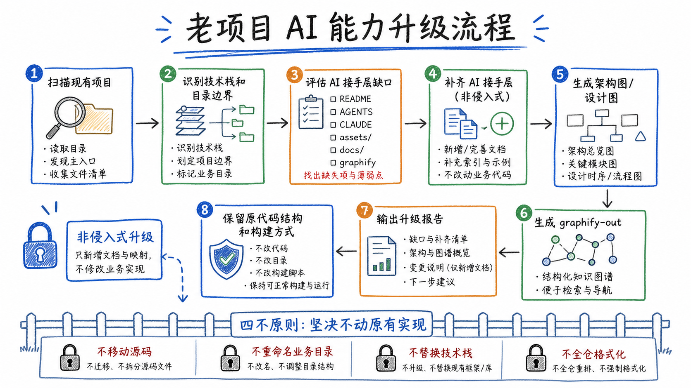
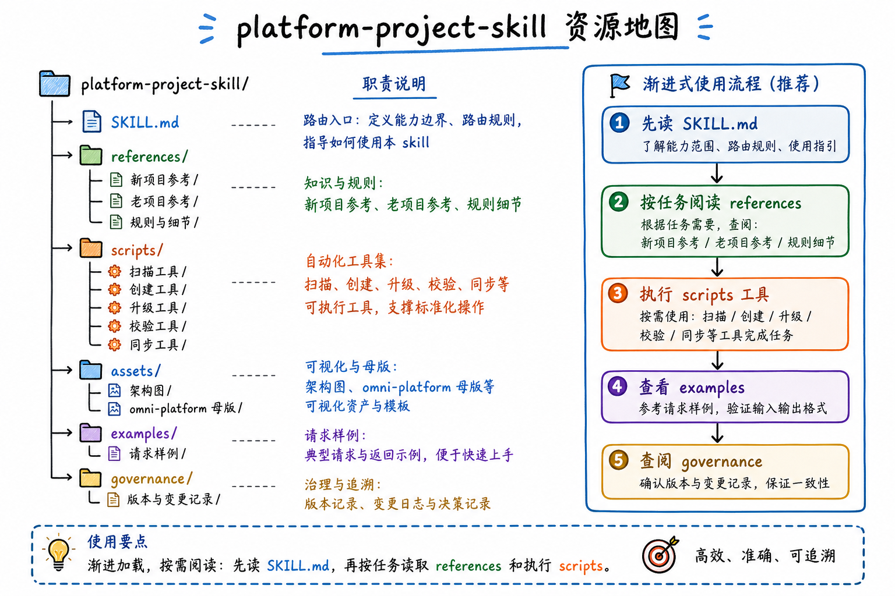

# Platform Project Skill

<!-- Keywords: claude-code skill, ai agent scaffold, platform project template, SKILL.md, omni-platform, codex skill, cursor skill, legacy codebase AI upgrade, AGENTS.md generator, CLAUDE.md generator, project scaffolding, developer tools, ai-assisted development -->

<div align="center">
  
</div>

<div align="center">
  <strong>Scaffold any platform project · Upgrade any legacy codebase for AI agents — in one command</strong>
  <br>
  <em>给你的 AI Agent 装上平台项目初始化能力：新项目一条命令建好骨架，老项目一条命令补齐 AI 接手层</em>
  <br><br>
  <code>SKILL.md</code>-format skill for <strong>Claude Code</strong> · <strong>Codex</strong> · <strong>Cursor</strong> — structure as documentation, ready for AI handoff on day one
  <br>
  <p>结构即文档，接手即开发</p>
  <br>
  <p>⭐ Star it if useful — 如果这个 skill 对你有用，点个 Star 让更多 Agent 开发者发现它</p>
</div>

<div align="center">

<a href="#快速开始">快速开始</a> · <a href="./docs/README_zh-tw.md">繁體中文</a> · <a href="./docs/README_en.md">English</a> · <a href="#工作流总览">支持平台</a> · <a href="#系统架构">设计理念</a> · <a href="#常见问题">FAQ</a>

</div>

<div align="center">

[](LICENSE)
[](#版本说明)
[](#项目状态)
[](scripts/)
[](#母版资产)
[](https://github.com/qierkang/platform-project-skill/pulls)
[](#快速开始)
[](https://github.com/qierkang/platform-project-skill/actions)
[](https://github.com/qierkang/platform-project-skill/stargazers)

</div>

---



---

## 为什么需要 Platform Project Skill？

你在用 AI Agent 开发，但每次启动新项目、接手老代码，总绕不开这些摩擦：

- 🗂️ "帮我初始化一个平台项目" → **靠感觉搭**，目录不统一、漏掉 Docker、缺 README、没有 AGENTS.md
- 🤖 "帮我接手这个老项目" → **AI Agent 读不懂**，没有 CLAUDE.md、没有接手层、从零开始摸索
- 📐 "帮我画个架构图" → **每次各搞一套**，有的放 `docs/`、有的放根目录、格式完全不统一
- 📝 "帮我写 README" → **占位符全没填完**，没通过 gate 就算交付了
- 🔄 "把这个项目给 AI 接手" → **不知道补什么**，AGENTS.md 写什么、graphify 要不要跑、哪些文件必须有

**这些不难解决，但需要一套固定规范和可复用的工程流程。**

**Platform Project Skill 把这两件事变成一条命令：**

告诉你的 AI Agent：

```
帮我初始化平台项目：~/.codex/codex-workspace/ai-workspace/skills/platform-project-skill/SKILL.md
```

或直接用脚本：

```bash
# 新项目：从 omni-platform 母版一键建好完整骨架
scripts/create-platform-project.sh my-platform /path/to/parent "My Platform" "我的平台"

# 老项目：非侵入式补齐所有 AI 接手层
scripts/upgrade-existing-project.sh /path/to/existing-project
```

| | |
|---|---|
| 🔄 **双路径工作流** | 同一个 skill 覆盖新项目初始化和老项目 AI 接手升级，不用切换工具 |
| 🛡️ **非侵入原则** | 老项目只补 AI 接手层，不移动源码、不重构目录、不替换技术栈 |
| ✅ **可校验交付** | 内置 README gate、资产校验、基线检查，完成前必须过验证，不允许虚报 |
| 📦 **母版内置** | `omni-platform` 母版快照随 skill 一起发布，无需网络拉取，离线可用 |
| 🤖 **兼容主流 Agent** | Claude Code、Codex、Cursor、OpenClaw……任何支持 SKILL.md 的 Agent 均可调用 |

---

## 项目概述

`platform-project-skill` 是一套专为 AI 编程工作流设计的项目脚手架技能包——新项目 30 秒建好完整骨架（目录 · Docker · README · AGENTS.md · CLAUDE.md · graphify 基线），老项目 60 秒补齐 AI 接手层，业务代码零修改。面向使用 Claude Code / Codex / Cursor 的开发者和团队，消除每次搭项目时的重复劳动，让 AI Agent 第一天就能高效接手任何项目。

> **English summary**: `platform-project-skill` is a `SKILL.md`-format AI agent skill for Claude Code, Codex, and Cursor. It scaffolds new platform projects from the `omni-platform` template in 30 seconds (fully offline), and non-invasively adds an AI handoff layer (`AGENTS.md`, `CLAUDE.md`, `START-HERE.md`) to any existing project — without touching business code. Any agent supporting the `SKILL.md` format can invoke it directly.

## 核心特色

- **双路径工作流**：新项目初始化（`new`）和老项目 AI 升级（`existing`）由同一个 skill 统一覆盖，路由自动识别
- **非侵入式升级**：老项目默认只补 AI 接手层，业务代码、目录结构、技术栈一律不动
- **母版驱动**：`assets/templates/omni-platform/` 是新项目的唯一来源，禁止从 AI 记忆重建，保证一致性
- **可校验交付**：内置 README gate + 资产注册校验 + 基线检查，`STATE=initialization_done` 才允许报告完成
- **脚本化自动化**：扫描、创建、升级、校验、同步全部封装为独立 Bash 脚本，可单独调用，也可组合执行

## 与同类方案对比

| 方案 | AI Agent 直接调用 | 老项目非侵入升级 | 内置校验 gate | 离线可用 | graphify 集成 |
|------|:---:|:---:|:---:|:---:|:---:|
| **Platform Project Skill** | ✅ SKILL.md | ✅ | ✅ | ✅ | ✅ |
| 手动搭建 | ❌ | ❌ | ❌ | ✅ | ❌ |
| Cookiecutter / Yeoman | ❌ | ❌ | ❌ | ✅ | ❌ |
| GitHub Template | ❌ | ❌ | ❌ | ❌ | ❌ |
| 直接让 AI 从记忆重建结构 | ✅ 但不稳定 | ✅ 但有风险 | ❌ | ✅ | ❌ |

## 工作流总览

| 场景 | 路由 | 说明 |
|------|------|------|
| 🆕 **新平台项目** | `new` | 从 `omni-platform` 母版复制骨架，替换命名，补齐所有标准文件 |
| 🔧 **老项目 AI 升级** | `existing` | 扫描现有结构，只补缺失的 AI 接手层，业务代码零修改 |
| 📝 **局部补全** | `partial` | 只补 README、assets、graphify 中的一项，适合轻量任务 |
| 🔀 **基座派生** | `hybrid` | 基于 omni-platform 重塑已有项目结构，保留原基座能力 |

> **不确定走哪条路？** 先跑 `scripts/inspect-project.sh <path>`，它会扫描项目现状并给出推荐路由。

---

## 快速开始

### 前置条件

- Claude Code / Codex / Cursor 等支持 SKILL.md 的 AI Agent
- Bash 4.0+（macOS 自带，Linux 默认满足）
- 可选：`image_gen` 工具（生成最终架构图时需要）

### 安装

```bash
# 推荐路径（Codex 用户）
cp -r platform-project-skill ~/.codex/codex-workspace/ai-workspace/skills/

# OpenClaw 用户
cp -r platform-project-skill ~/.openclaw/skills/
```

### 创建新平台项目

```bash
# 基础用法（英文名从 slug 自动转 Title Case）
scripts/create-platform-project.sh my-platform /path/to/parent

# 带自定义中英文显示名
scripts/create-platform-project.sh my-platform /path/to/parent "My Platform" "我的平台"
```

执行后 30 秒内自动生成：

<details>
<summary>查看生成的完整项目结构</summary>

```text
my-platform/
├── README.md           ← 已填入项目名、描述、版本、作者
├── AGENTS.md           ← AI Agent 接手说明
├── CLAUDE.md           ← Claude Code 专属规则
├── START-HERE.md       ← 首次接手导航
├── docker-compose.yml  ← 多服务编排配置
├── assets/
│   └── platform/architecture/   ← 架构图目录（含 prompt）
├── docs/
│   ├── requirements/            ← 需求文档模板
│   ├── design/                  ← 技术方案、UI 规范
│   └── testing/                 ← 测试用例、验收报告模板
├── my-platform-front/           ← 前端工程（React + Vite）
├── my-platform-server/          ← 服务端工程（含 Docker）
├── my-platform-mobile/          ← 移动端工程
├── scripts/                     ← doctor / dev-summary 等工具脚本
└── graphify-out/GRAPH_REPORT.md ← AI 可读的代码知识图谱基线
```

</details>





### 升级老项目 AI 接手层

```bash
# 默认保守模式：只补 AGENTS / CLAUDE / START-HERE / 升级报告
scripts/upgrade-existing-project.sh /path/to/existing-project

# 同时创建 assets/ 平台目录
scripts/upgrade-existing-project.sh /path/to/existing-project --with-assets

# 同时创建 docs/ 标准文档结构
scripts/upgrade-existing-project.sh /path/to/existing-project --with-platform-docs

# 预览模式，不实际写文件
scripts/upgrade-existing-project.sh /path/to/existing-project --dry-run
```

### 校验项目基线

```bash
# 新项目（严格模式）
scripts/check-project-baseline.sh /path/to/project

# 老项目（manifest 可缺失，降级为 WARN）
scripts/check-project-baseline.sh --existing /path/to/project
```

---

## 功能模块

### 新项目初始化

- 从内置 `omni-platform` 母版复制完整骨架（front / mobile / server / assets / docs / Docker）
- 批量替换项目名、目录名、服务名和 README 身份信息
- 自动生成 README.md、AGENTS.md、CLAUDE.md、START-HERE.md
- 初始化 graphify 基线，AI Agent 可立即接手开发

### 老项目 AI 能力升级

- `inspect-project.sh` 扫描现有结构，输出精确缺口报告，决定升级深度
- 只补缺失的 AI 接手层，不动业务代码、不重构目录
- `.gitignore`-aware：不创建与忽略规则冲突的文件
- 语言感知：根据项目技术栈自动调整 CLAUDE.md 内容
- 输出结构化升级报告，明确改动边界和后续建议

### 资产与图谱管理

- 维护架构图、设计图、流程图的 prompt 模板（`assets/prompts/`）
- 最终展示图必须通过 `image_gen` 生成，通过 `register-asset.sh` 注册到 manifest
- `verify-assets.sh` 检测孤儿图和未注册资产，防止 README 断链
- 可选运行 `/graphify` 生成或刷新代码知识图谱

---

## 技术栈

| 层级 | 技术 / 资产 | 说明 |
|---|---|---|
| Skill 入口 | `SKILL.md` | 触发描述、路由规则和最小执行约束 |
| 规则文档 | `references/*.md` | 新项目、老项目、README、assets、graphify 详细规则，按需加载 |
| 自动化脚本 | Bash | 扫描、创建、升级、校验、同步，每个脚本均可独立调用 |
| 母版资产 | `assets/templates/omni-platform/` | 官方平台母版快照，新项目的唯一来源 |
| 架构图 | `assets/architecture/*.png` | skill 自身的工作流图和资源地图 |
| 视觉生成 | `image_gen` | 最终架构图、设计图、流程图的生成工具 |
| README 校验 | `~/.claude/scripts/readme-gate.py` | README 内容完整性与结构合规检查 |

---

## 系统架构

### 工作流设计

```text
User Request
    ↓
SKILL.md（路由识别：new / existing / partial / hybrid）
    ↓
scripts/inspect-project.sh          ← 扫描项目现状
    ↓
┌─────────────────────┬──────────────────────────────┐
│   New Project       │   Existing Project            │
│                     │                               │
│ create-platform-    │ upgrade-existing-             │
│ project.sh          │ project.sh                    │
│     ↓               │     ↓                         │
│ image_gen（架构图）  │ verify-assets.sh              │
└─────────────────────┴──────────────────────────────┘
    ↓
scripts/check-project-baseline.sh
    ↓
README · AGENTS · CLAUDE · assets · docs · graphify
```

### 架构说明

- `SKILL.md` 只负责路由识别，保持极轻量，避免上下文膨胀
- 详细规则按需加载自 `references/`，单次任务通常只需 1 个 workflow + 1–3 个规则文件
- 重复性动作封装进 `scripts/`，每个脚本通过 `bash -n` 语法校验后才能合入
- `assets/templates/omni-platform/` 是新项目的唯一母版来源，禁止从 AI 记忆重建



---

## 目录结构

```text
platform-project-skill/
├── SKILL.md                          # 触发入口与路由规则
├── START-HERE.md                     # 首次接手导航
├── README.md                         # 本文档
├── AGENTS.md                         # Agent 接手说明
├── CLAUDE.md                         # Claude Code 专属配置
├── assets/
│   ├── architecture/                 # skill 自身架构图（.png）
│   ├── prompts/                      # 图片生成 prompt 模板
│   └── templates/
│       └── omni-platform/            # 官方平台母版快照
├── references/
│   ├── INDEX.md                      # 规则索引（按需加载入口）
│   ├── workflow-new-project.md       # 新项目工作流
│   ├── workflow-existing-project.md  # 老项目工作流
│   ├── readme-rules.md               # README 生成规则
│   ├── assets-rules.md               # 资产管理规则
│   └── ...
├── scripts/
│   ├── create-platform-project.sh    # 新项目创建
│   ├── upgrade-existing-project.sh   # 老项目升级
│   ├── inspect-project.sh            # 项目扫描
│   ├── check-project-baseline.sh     # 基线校验
│   ├── verify-assets.sh              # 资产校验
│   ├── register-asset.sh             # 资产注册
│   └── sync-omni-template.sh         # 母版同步
├── examples/                         # 完整流程示例快照
└── governance/                       # 风险记录与决策日志
```

---

## 命令参考

| 命令 | 说明 |
|------|------|
| `scripts/inspect-project.sh <path>` | 扫描项目现状，输出缺口报告，决定走哪条路由 |
| `scripts/create-platform-project.sh <slug> <parent> [name] [cn]` | 从 omni-platform 母版创建新平台项目 |
| `scripts/upgrade-existing-project.sh <path> [flags]` | 非侵入式升级老项目，补齐 AI 接手层 |
| `scripts/verify-assets.sh <path>` | 校验资产注册表，检测孤儿图和缺失图 |
| `scripts/check-project-baseline.sh [--existing] <path>` | 完整基线校验：README gate + 资产 + 目录结构 |
| `scripts/register-asset.sh <project> <image-path>` | 注册新生成的图片到 `asset-manifest.json` |
| `scripts/sync-omni-template.sh` | 从上游同步 omni-platform 母版到最新版本 |

---

## 开发指南

### 修改触发规则

改触发条件和路由 → 优先改 `SKILL.md`，不要动 `references/`

### 修改详细流程

改流程规则 → 优先改 `references/` 中对应的规则文件，单个任务通常只需修改 1–3 个文件

### 修改脚本

改重复性动作 → 优先改 `scripts/`，改完必须跑 `bash -n <script>` 通过语法校验再提交

### 同步母版

```bash
# 正确方式：走同步脚本
scripts/sync-omni-template.sh

# 禁止手动编辑 assets/templates/omni-platform/
# 下次同步会覆盖所有手动修改
```

### 新增图片资产

```bash
# 1. 用 image_gen 生成图片
# 2. 注册到 manifest
scripts/register-asset.sh . assets/architecture/new-diagram.png

# 3. 校验无孤儿图
scripts/verify-assets.sh .
```

---

## 开发与验证

### 验证步骤（按顺序执行）

```bash
# 1. 脚本语法检查
for f in scripts/*.sh; do bash -n "$f" && echo "ok: $f"; done

# 2. README gate
~/.claude/scripts/readme-gate.py --readme README.md

# 3. 完整基线校验
scripts/check-project-baseline.sh .
```

三项全绿才算验证通过。任何 `STATE=failed` 或孤儿图警告均不允许使用"完成"措辞。

### 验证要求

- README 必须通过 gate（无缺失节、无占位符、以 `# ` 开头）
- 脚本必须通过 `bash -n` 语法检查
- skill 目录内不得保留 `.DS_Store`、`node_modules`、`dist`
- README 展示图不得放进 fenced code block，必须用 `` 直接引用

---

## 🚦 项目状态

- 当前状态：`生产可用`
- 版本阶段：`0.3.0 · Stable`
- 维护方式：随 `omni-platform` 母版持续同步
- 兼容范围：`macOS / Linux · Bash 4.0+ · Claude Code / Codex / Cursor / OpenClaw`
- 已知风险与回归证据：见 [governance/RISKS.md](./governance/RISKS.md)

---

## 常见问题

<details>
<summary><strong>如何初始化一个新平台项目？</strong></summary>

```bash
scripts/create-platform-project.sh my-platform /path/to/parent "My Platform" "我的平台"
```

执行完成后，必须等 `STATE=initialization_done` 才向用户报告完成。流程：`scaffold_done → asset_done → validation_done → initialization_done`，禁止跨越任何阶段。
</details>

<details>
<summary><strong>老项目升级会改动我的业务代码吗？</strong></summary>

不会。`upgrade-existing-project.sh` 默认只新建以下文件，不动任何已有文件：

- `AGENTS.md`、`CLAUDE.md`、`START-HERE.md`（AI 接手层）
- `docs/ai-upgrade/upgrade-report.md`（升级报告）

需要扩展资产目录加 `--with-assets`；需要文档结构加 `--with-platform-docs`；先用 `--dry-run` 预览所有变更。
</details>

<details>
<summary><strong>架构图可以用 Mermaid / SVG 代替 image_gen 吗？</strong></summary>

不可以。README 里的展示图必须通过 `image_gen` 生成最终 `.png`，并通过 `register-asset.sh` 注册到 `asset-manifest.json`。

Mermaid / SVG / HTML 只用于过程讨论和草稿，不是最终交付物。`verify-assets.sh` 会检测未注册的孤儿图并报错阻断流程。
</details>

<details>
<summary><strong>README 怎么算生成完成？</strong></summary>

必须通过 gate：

```bash
~/.claude/scripts/readme-gate.py --readme README.md
```

gate 通过 + 所有占位符已替换 = README done。否则不允许向用户报告交付。
</details>

<details>
<summary><strong>skill 兼容哪些 AI Agent？</strong></summary>

任何支持 `SKILL.md` 的 Agent 均可使用：Claude Code、Codex、Cursor、OpenClaw、Windsurf。安装时将 skill 目录复制到对应 Agent 的 skills 路径，重启 Agent 即生效。
</details>

---

## 参与贡献

欢迎 Issue 和 PR！无论是 Bug 报告、功能建议还是文档改进，都是对这个项目的贡献。

**如何参与：**

1. **报告 Bug**：提 Issue，附上 `scripts/inspect-project.sh` 的输出和最小复现步骤
2. **新功能建议**：先开 Issue 讨论方向，确认可行后再提 PR，避免无效劳动
3. **脚本修改**：改完必须通过 `bash -n <script>` 语法校验，提 PR 时附上验证结果
4. **文档修改**：改完必须通过 `~/.claude/scripts/readme-gate.py --readme README.md`，gate 通过再提交

**完整贡献指南请见 [CONTRIBUTING.md](./CONTRIBUTING.md)** —— 含本地验证步骤、提交前检查清单、代码规范。

**[阅读贡献指南 →](./CONTRIBUTING.md)** · **[查看 Issues →](https://github.com/qierkang/platform-project-skill/issues)** · **[提交 PR →](https://github.com/qierkang/platform-project-skill/pulls)**

> English contributors are welcome! Feel free to submit PRs or issues in English. See [docs/README_en.md](./docs/README_en.md) for the English documentation and [CONTRIBUTING.md](./CONTRIBUTING.md) for the contribution guide.

---

## 版本说明

| 版本 | 状态 | 变更摘要 |
|------|------|---------|
| `0.3.0` | 当前 | 双路径工作流、资产注册校验、README gate 集成 |
| `0.2.0` | 归档 | 老项目升级脚本、non-invasive 原则落地 |
| `0.1.0` | 归档 | 新项目初始化、omni-platform 母版内置 |

> 完整变更历史见 [CHANGELOG.md](./CHANGELOG.md)，遵循 [Keep a Changelog](https://keepachangelog.com/) 与语义化版本。

---

## 致谢

本项目建立在以下优秀项目之上：

[Claude Code](https://github.com/anthropics/claude-code) · [Codex CLI](https://github.com/openai/codex) · [graphify](https://github.com/qierkang/graphify) · [omni-platform](https://github.com/qierkang/omni-platform) · [Agent-Reach](https://github.com/Panniantong/Agent-Reach) · [codebase-memory-mcp](https://github.com/DeusData/codebase-memory-mcp)

---

## Star History · Star 历史

如果这个 skill 对你有帮助，欢迎点亮一颗 Star ⭐ —— If this skill helps you, please consider giving it a star.

<div align="center">

[](https://github.com/qierkang/platform-project-skill/stargazers)

📈 **[查看实时 Star 增长曲线 → star-history.com](https://star-history.com/#qierkang/platform-project-skill&Date)**

</div>

<!--
当 star 数较多后（图表有曲线、owner 头像破损不再显眼），可删除上方徽章区块，
取消下面这段官方 star-history 代码的注释，即可切换为带暗色模式适配的动态图表。
注意：star-history 的 SVG 内嵌了 owner 头像的外链 <image>，GitHub 把 SVG 当 
加载时浏览器安全沙箱会拦截该外链，导致头像在 star 很少时显示为破损图标。

<a href="https://www.star-history.com/?repos=qierkang%2Fplatform-project-skill&type=date&legend=bottom-right">
 <picture>
   <source media="(prefers-color-scheme: dark)" srcset="https://api.star-history.com/chart?repos=qierkang/platform-project-skill&type=date&theme=dark&legend=top-left" />
   <source media="(prefers-color-scheme: light)" srcset="https://api.star-history.com/chart?repos=qierkang/platform-project-skill&type=date&legend=top-left" />
   
 </picture>
</a>
-->


---

## 许可证

MIT License © 2026 [qierkang](https://github.com/qierkang)

---

## 作者

- **Email**：xyqierkang@gmail.com
- **GitHub**：[github.com/qierkang](https://github.com/qierkang)
