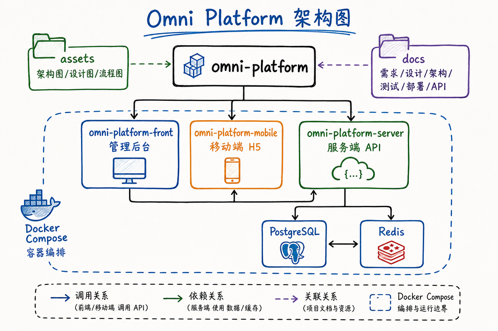

# Assets 资产说明

`assets/` 是 `omni-platform` 的统一视觉资产仓，不建议在每个子项目下面重复创建一套独立 `assets/`。

## 设计原则

- 单一真值源：同一张架构图、设计图、流程图只保留一份正式版本。
- 根级统一管理：所有图片都放在根目录 `assets/` 下，避免三端各自复制。
- 按作用域分区：平台总图放 `platform/`，子项目专属图放各自目录。
- README 可直接引用：根 README 用 `./assets/...`，子项目 README 用 `../assets/...`。

## 当前目录约定

```text
assets/
├── platform/
│   ├── architecture/
│   ├── design/
│   └── flow/
├── omni-platform-front/
│   ├── screenshots/
│   └── design/
├── omni-platform-mobile/
│   ├── screenshots/
│   └── design/
└── omni-platform-server/
    ├── architecture/
    └── api/
```

## 使用规则

### 平台级资产

- 放平台整体架构、总流程、统一视觉规范
- 目录：
  - `assets/platform/architecture/`
  - `assets/platform/design/`
  - `assets/platform/flow/`

### 管理端资产

- 放管理端首页截图、后台页面设计图、交互稿
- 目录：
  - `assets/omni-platform-front/screenshots/`
  - `assets/omni-platform-front/design/`

### 移动端资产

- 放 H5 页面截图、移动端设计图、流程页草图
- 目录：
  - `assets/omni-platform-mobile/screenshots/`
  - `assets/omni-platform-mobile/design/`

### 服务端资产

- 放接口拓扑图、模块架构图、API 说明图
- 目录：
  - `assets/omni-platform-server/architecture/`
  - `assets/omni-platform-server/api/`

## README 引用示例

### 根目录 README

```md

```

### 管理端 README

```md

```

### 管理端专属截图

```md

```

## 当前已生成资产

- 平台总图：
  - `assets/platform/architecture/omni-platform-overview.png`
- 平台设计基线图：
  - `assets/platform/design/omni-platform-design-baseline.png`
- 管理端示意图：
  - `assets/omni-platform-front/screenshots/front-dashboard-concept.png`
- 管理端 UI 设计稿：
  - `assets/omni-platform-front/design/front-ui-design-draft.png`
- 移动端示意图：
  - `assets/omni-platform-mobile/screenshots/mobile-home-concept.png`
- 移动端 UI 设计稿：
  - `assets/omni-platform-mobile/design/mobile-ui-design-draft.png`
- 服务端架构图：
  - `assets/omni-platform-server/architecture/server-architecture-concept.png`

## 结论

当前母版推荐方案不是“每个子项目都再建一套独立 assets”，而是：

- 根目录统一一个 `assets/`
- 在 `assets/` 下按 `platform / front / mobile / server` 分区
- 各自 README 通过相对路径引用

这样后续派生真实项目时，结构最稳，也最不容易出现重复文件和路径混乱。

## 作者

- 作者：`xyqierkang@gmail.com`
- GitHub：[https://github.com/qierkang](https://github.com/qierkang)
