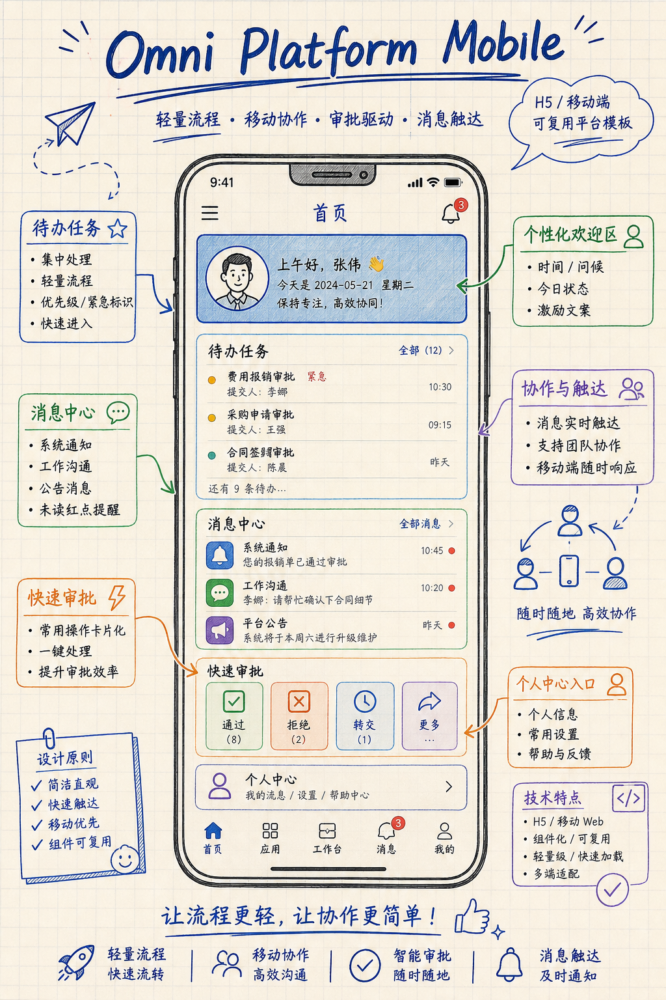
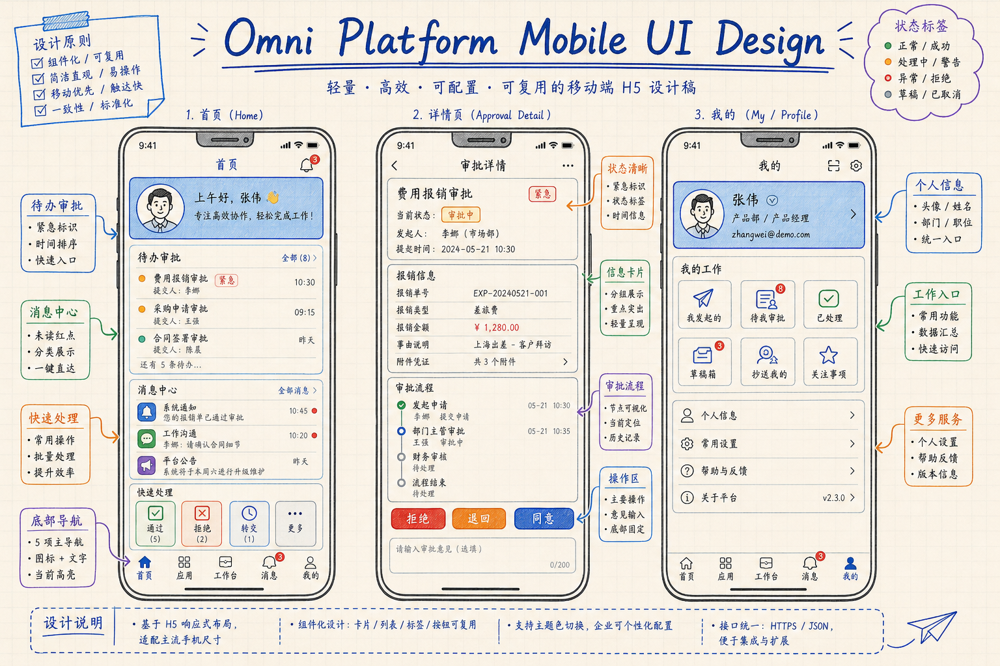

# Omni Platform Mobile

<div align="center">
  <strong>通用平台母版移动端 · React + Vite · H5 / Mobile Web 壳工程 · 对接 omni-platform-server</strong>
  <br>
  <br>
  <p>这是 <code>omni-platform</code> 的移动端子工程，用于承接 H5、移动 Web、轻量流程页和后续移动协同场景。</p>
  <p>适合继续派生审批、待办、消息、个人中心和轻业务流程页面。</p>
</div>

第一次接手这个子工程，建议先看 [根目录 README.md](../README.md) 和 [docs/INDEX.md](../docs/INDEX.md)。

<div align="center">

[](#-许可证)
[](#-版本说明)
[](#-项目状态)
[](#-开发与验证)

</div>

---

## 🗺️ 架构图

先看整体平台分层，再理解当前移动端在多端体系中的位置。





## 📋 项目概述

`Omni Platform Mobile` 是平台母版中的移动端工程，当前以最小可构建 React + Vite 移动壳工程存在，用于承接用户侧 H5、移动待办、审批流、消息和个人中心等轻量场景。

- 它做什么：承接移动端页面、轻流程操作、信息展示和后续用户侧入口。
- 为什么做它：把移动端和管理端彻底拆分，避免样式、交互和目录结构互相污染。
- 目标用户：需要同时维护后台与移动协同入口的前端团队。
- 适用场景：H5、移动 Web、审批流、待办、消息中心、用户侧轻业务。
- 它承担什么角色：作为平台母版的移动端前端入口，对接 `omni-platform-server`。

## 🎯 核心特色

- **移动端单独建仓位**：与管理端目录隔离，便于独立节奏开发和发布。
- **轻量 H5 基线**：当前保持最小可构建状态，便于后续快速派生具体移动场景。
- **对接服务端统一**：和管理端共享平台服务端，减少接口重复定义。
- **适合做轻业务流程**：审批、查询、消息、个人中心等移动能力可直接往里扩展。
- **容器化路径预留**：已保留 `Dockerfile`，便于统一纳入平台部署编排。

## 👀 在线演示 / 效果预览

- 演示地址：`http://127.0.0.1:7062`
- 文档地址：`../docs/`
- API 文档：`http://127.0.0.1:7060/meta`
- 视频演示：`未配置`

### 截图预览


- 当前示意图已落到 `../assets/omni-platform-mobile/screenshots/mobile-home-concept.png`
- 当前 UI 设计稿已落到 `../assets/omni-platform-mobile/design/mobile-ui-design-draft.png`

## 🚦 项目状态

- 当前状态：`初始化完成`
- 版本阶段：`Template Alpha`
- 维护方式：`持续迭代`
- 兼容范围：`Node 20+ / pnpm 10+ / 移动浏览器 / Docker 本地编排`

当前版本更适合做派生移动端母版，而不是直接原样上线生产。

## 📌 版本说明

- 当前版本：`1.0.0-alpha`
- 版本定位：`移动端初始化母版`
- 本轮重点：`补齐子工程 README、明确移动端职责、保留后续待办与审批扩展入口`
- 后续方向：`继续补移动首页、消息页、我的页和轻流程交互示例`

## 🧩 功能模块

### 移动页面壳层

- 承接移动首页、待办、消息、我的等页面
- 适合继续补底部导航、吸顶区块和移动列表页
- 作为移动端统一 UI 壳工程

### 轻流程交互层

- 可承接审批、确认、查看详情、状态流转等轻交互
- 支持与后台系统共享 API 和业务域
- 适合继续补表单、步骤流和状态页

### 用户入口与展示层

- 可扩展用户中心、通知、快捷入口和业务摘要
- 面向移动端场景优化信息密度和操作节奏
- 与管理端形成角色互补

## 🛠️ 技术栈

| 层级 | 技术 | 说明 |
|---|---|---|
| 前端框架 | React 18 | 移动端视图层 |
| 构建工具 | Vite 7 | 本地开发与构建 |
| 语言 | TypeScript 5 | 类型约束 |
| 渲染 | React DOM | 移动浏览器渲染入口 |
| 部署 | Dockerfile + 静态托管思路 | 便于容器化交付 |
| 开发工具 | pnpm | 依赖与脚本管理 |

关键依赖：

- `react`：承载移动端页面与组件。
- `vite`：保证移动端壳工程快速启动。

## 🏗️ 系统架构

### 架构设计

```text
┌────────────────────────────────────────────┐
│              Mobile View Layer             │
│  H5 Pages / Cards / Tabs / Action Panels   │
└────────────────────────────────────────────┘
                    ↓
┌────────────────────────────────────────────┐
│           Mobile Interaction Layer         │
│  Touch Events / Forms / Flows / Feedback   │
└────────────────────────────────────────────┘
                    ↓
┌────────────────────────────────────────────┐
│             Integration Layer              │
│      HTTP API / Env Config / Errors        │
└────────────────────────────────────────────┘
                    ↓
┌────────────────────────────────────────────┐
│            Backend Dependency              │
│         omni-platform-server APIs          │
└────────────────────────────────────────────┘
```

### 架构说明

- 当前工程负责移动端展示和轻流程交互，不承载服务端逻辑。
- 移动端默认与管理端共享服务端 API，但页面结构与交互节奏独立。
- 后续建议按页面、组件、请求、状态和适配策略进一步拆分目录。
- 视觉和交互规则默认对齐 [DESIGN.md](../docs/design/DESIGN.md)。

## 📁 目录结构

```text
.
├── src/
├── index.html
├── package.json
├── tsconfig.json
├── vite.config.ts
├── Dockerfile
└── README.md
```

### 目录说明

| 目录 / 文件 | 说明 |
|---|---|
| `src/` | 移动端源码入口，后续承接页面、组件、导航和请求逻辑 |
| `index.html` | Vite 入口 HTML |
| `package.json` | 移动端启动、构建、预览命令入口 |
| `vite.config.ts` | Vite 开发与构建配置 |
| `Dockerfile` | 移动端容器化构建入口 |

构建后的 `dist/` 是本地产物，不作为母版源码目录保留。

## 🚀 快速开始

### 环境要求

- `Node >= 20`
- `pnpm >= 10`
- `移动浏览器`
- `可选：Docker >= 24`

### 安装依赖

```bash
cd <项目根目录>/omni-platform-mobile
pnpm install
```

### 配置环境变量

当前版本默认复用根项目环境变量，重点关注：

| 变量名 | 是否必填 | 说明 |
|---|---|---|
| `API_BASE_URL` | 是 | 移动端请求的服务端地址 |
| `MOBILE_PORT` | 是 | 本地或容器内移动端端口 |

### 启动项目

```bash
pnpm dev
```

### 默认访问地址

- Mobile：`http://127.0.0.1:7062`
- API：`http://127.0.0.1:7060`

## 🔧 开发指南

### 常用命令

| 命令 | 说明 |
|---|---|
| `pnpm dev` | 启动移动端开发服务 |
| `pnpm build` | 构建移动端产物 |
| `pnpm preview` | 本地预览构建结果 |

### 关键配置入口

| 配置项 | 文件路径 | 说明 |
|---|---|---|
| 前端脚本 | `package.json` | 定义开发、构建、预览命令 |
| 构建配置 | `vite.config.ts` | 端口、插件、构建行为 |
| 类型配置 | `tsconfig.json` | TypeScript 编译规则 |
| 容器配置 | `Dockerfile` | 镜像构建入口 |

### 常见改动位置

| 需求类型 | 建议改动位置 |
|---|---|
| 首页 / 入口页 | `src/` 下首页模块 |
| 待办 / 审批 | `src/` 下流程页面模块 |
| 我的 / 消息 | `src/` 下用户中心与通知模块 |
| API 对接 | `src/` 下请求封装层 |

## 🧪 开发与验证

当前建议的最小验证顺序：

1. `pnpm build`
2. 浏览器访问 `http://127.0.0.1:7062`
3. 对接 `http://127.0.0.1:7060/meta` 检查联通性

## 🤝 与其他子项目的关系

- 上游母版入口：[`../README.md`](../README.md)
- 设计与交付文档：[`../docs/INDEX.md`](../docs/INDEX.md)
- 服务端依赖：[`../omni-platform-server/README.md`](../omni-platform-server/README.md)
- 管理端同级工程：[`../omni-platform-front/README.md`](../omni-platform-front/README.md)

## 👤 作者

- 作者：`xyqierkang@gmail.com`
- GitHub：[https://github.com/qierkang](https://github.com/qierkang)

## 📄 许可证

当前项目默认按内部模板仓库使用，许可证口径以根项目为准。
