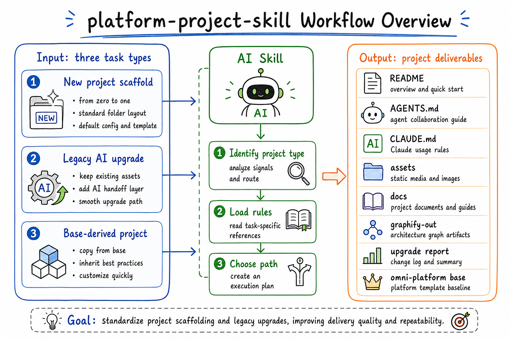
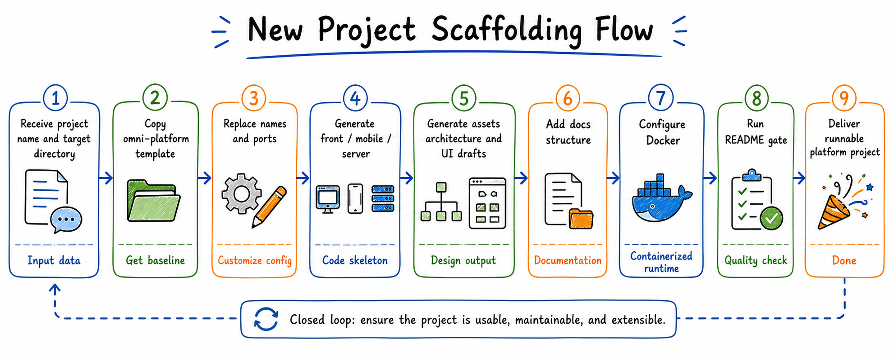
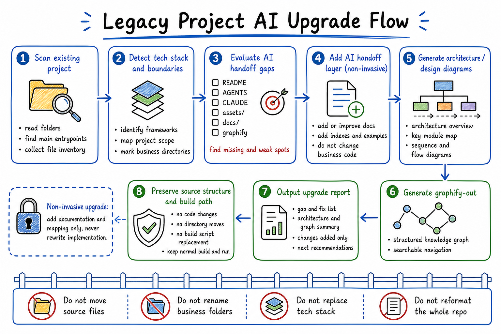
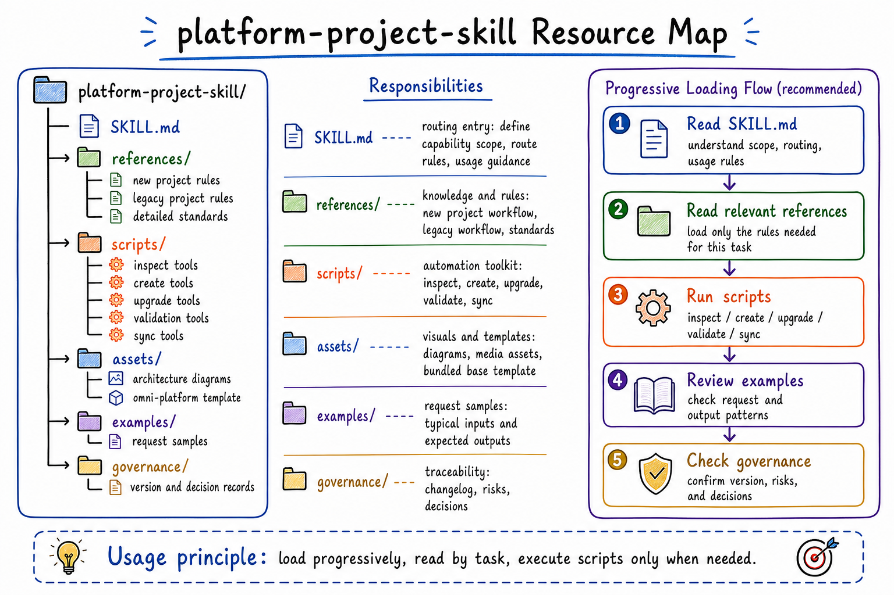

# Platform Project Skill — English Documentation

<div align="center">
  <em>A SKILL.md-format AI agent skill that scaffolds platform projects and upgrades legacy codebases for AI-assisted development.</em>
</div>

<div align="center">

[简体中文](../README.md) · [繁體中文](./README_zh-tw.md) · **English** · [Quick Start](#quick-start) · [FAQ](#faq)

</div>

---

## What Is This?

`platform-project-skill` is a `SKILL.md`-format skill package for AI agents (Claude Code, Codex, Cursor, OpenClaw). It covers two workflows:

- **New project**: Copies from the bundled `omni-platform` template → generates a complete scaffold (`README`, `AGENTS.md`, `CLAUDE.md`, `docker-compose.yml`, `docs/`, frontend + backend stubs) in under 30 seconds. Fully offline, no network required.
- **Existing project**: Non-invasively adds an AI handoff layer (`AGENTS.md`, `CLAUDE.md`, `START-HERE.md`) to any codebase, without touching business code, directory structure, or tech stack.



### Why SKILL.md?

The `SKILL.md` format lets AI agents discover and invoke this skill directly from natural language. You don't run a CLI command — you tell your AI agent what you need:

```
Initialize a platform project: path/to/SKILL.md
```

The agent reads `SKILL.md`, picks the right route (`new` / `existing` / `partial`), and executes the correct scripts automatically.

---

## Quick Start

### Install

```bash
# For Codex users
cp -r platform-project-skill ~/.codex/codex-workspace/ai-workspace/skills/

# For OpenClaw users
cp -r platform-project-skill ~/.openclaw/skills/
```

### Scaffold a New Project

Tell your AI agent:

```
Initialize a platform project at /path/to/parent
Skill: ~/.codex/codex-workspace/ai-workspace/skills/platform-project-skill/SKILL.md
```

Or run the script directly:

```bash
scripts/create-platform-project.sh my-platform /path/to/parent "My Platform" "我的平台"
```

**What you get in 30 seconds:**

```text
my-platform/
├── README.md              ← Pre-filled with project name, author, version
├── AGENTS.md              ← AI agent handoff instructions
├── CLAUDE.md              ← Claude Code configuration
├── START-HERE.md          ← First-time navigation guide
├── docker-compose.yml     ← Multi-service orchestration
├── assets/
│   └── platform/architecture/    ← Architecture diagram directory
├── docs/
│   ├── requirements/             ← Requirements templates
│   ├── design/                   ← Technical design, UI specs
│   └── testing/                  ← Test cases, acceptance report templates
├── my-platform-front/            ← Frontend project (React + Vite)
├── my-platform-server/           ← Backend project (with Docker)
├── my-platform-mobile/           ← Mobile project
├── scripts/                      ← doctor / dev-summary utilities
└── graphify-out/GRAPH_REPORT.md  ← AI-readable codebase knowledge graph baseline
```

### Upgrade an Existing Project

```bash
# Conservative mode: only adds AGENTS.md, CLAUDE.md, START-HERE.md, upgrade report
scripts/upgrade-existing-project.sh /path/to/existing-project

# Preview all changes without writing files
scripts/upgrade-existing-project.sh /path/to/existing-project --dry-run

# Also create assets/ platform directory
scripts/upgrade-existing-project.sh /path/to/existing-project --with-assets

# Also create docs/ standard structure
scripts/upgrade-existing-project.sh /path/to/existing-project --with-platform-docs
```

**What the upgrade adds (and what it never touches):**

| Added by upgrade | Never touched |
|---|---|
| `AGENTS.md` | Source code |
| `CLAUDE.md` | Existing directory structure |
| `START-HERE.md` | Tech stack / frameworks |
| `docs/ai-upgrade/upgrade-report.md` | Config files, `.gitignore` |

---

## Core Concepts

### Dual-Path Routing

One skill covers both workflows. The agent auto-detects the route:

| Trigger | Route | Core Script |
|---|---|---|
| "initialize platform project" | `new` | `scripts/create-platform-project.sh` |
| "upgrade legacy project for AI" | `existing` | `scripts/upgrade-existing-project.sh` |
| "only fix README / add assets" | `partial` | Per-rule file in `references/` |
| Not sure which route | Scan first | `scripts/inspect-project.sh` |





### Non-Invasive Principle

The existing-project upgrade never modifies files that already exist. It only adds the AI handoff layer on top of whatever structure is already there.

### Validation Gate

Every delivery must pass a gate before the agent can report completion:

```bash
# 1. Script syntax check
for f in scripts/*.sh; do bash -n "$f" && echo "ok: $f"; done

# 2. README completeness check
~/.claude/scripts/readme-gate.py --readme README.md

# 3. Full baseline validation
scripts/check-project-baseline.sh /path/to/project
```

State model: `scaffold_done → asset_done → validation_done → initialization_done`  
The agent cannot use the word "done" until `STATE=initialization_done`.

---

## Command Reference



| Command | Description |
|---|---|
| `scripts/inspect-project.sh <path>` | Scan project state, output gap report, recommend route |
| `scripts/create-platform-project.sh <slug> <parent> [name] [cn]` | Create new platform project from `omni-platform` template |
| `scripts/upgrade-existing-project.sh <path> [flags]` | Non-invasively upgrade existing project |
| `scripts/verify-assets.sh <path>` | Validate asset registry, detect orphan/missing images |
| `scripts/check-project-baseline.sh [--existing] <path>` | Full baseline check: README gate + assets + directory |
| `scripts/register-asset.sh <project> <image-path>` | Register a new image to `asset-manifest.json` |
| `scripts/add-star-history.sh <project> <owner>/<repo>` | Add verified Star History links after the first public push for the required second commit |
| `scripts/sync-omni-template.sh` | Sync the bundled `omni-platform` template to latest |

---

## Compatibility

| Agent | Supported | Install Path |
|---|---|---|
| Claude Code | ✅ | `~/.codex/codex-workspace/ai-workspace/skills/` |
| Codex CLI | ✅ | `~/.codex/codex-workspace/ai-workspace/skills/` |
| Cursor | ✅ | Cursor skills directory |
| OpenClaw | ✅ | `~/.openclaw/skills/` |
| Windsurf | ✅ | Windsurf skills directory |

Requirements: Bash 4.0+ (macOS built-in satisfies this). Optional: `image_gen` for generating final architecture diagrams.

---

## FAQ

**Does the upgrade touch my business code?**  
No. `upgrade-existing-project.sh` only creates new files. It never modifies, moves, or deletes existing files.

**Can I use Mermaid or SVG instead of `image_gen` for diagrams?**  
For draft discussion: yes. For README display images: no. Final display images must be `.png` generated by `image_gen` and registered via `register-asset.sh`. The `verify-assets.sh` script will error on unregistered images.

**What agents can use this skill?**  
Any agent that supports the `SKILL.md` format: Claude Code, Codex, Cursor, OpenClaw, Windsurf. Copy the skill directory to the agent's skills path and restart.

**How do I know when a project is fully initialized?**  
The state model is `scaffold_done → asset_done → validation_done → initialization_done`. The agent must not report completion until `STATE=initialization_done`. Run `scripts/check-project-baseline.sh` to verify.

---

## Contributing

Issues and PRs are welcome! See the [main README](../README.md#参与贡献) for contribution guidelines.

---

## License

MIT License © 2026 [qierkang](https://github.com/qierkang)
